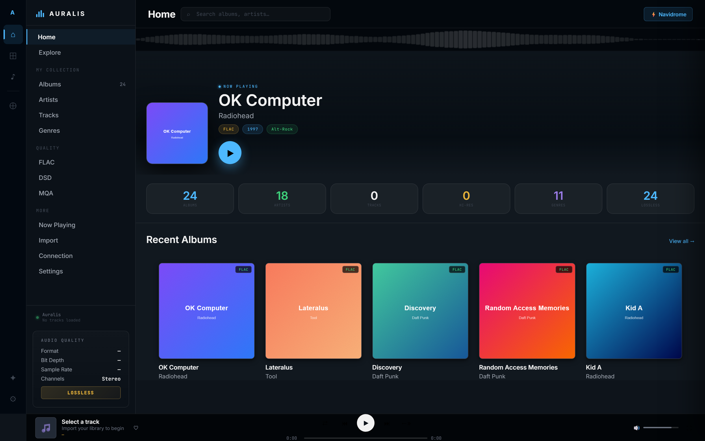
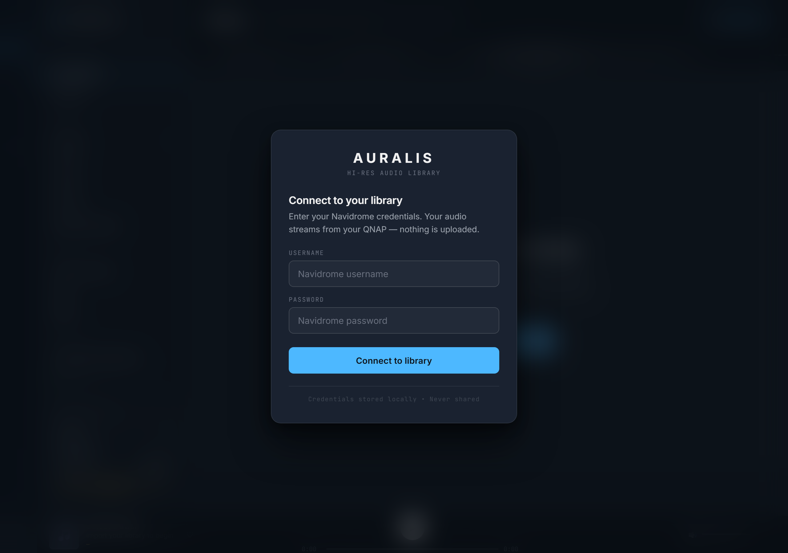

# Auralis

> **A hi-res audio library for your phone, served from your own QNAP.**
> Stream FLAC, ALAC, DSD and 24-bit lossless from a Navidrome server you control — no Spotify, no Tidal, no cloud subscription.

[](https://high-fidelity-audio-system.vercel.app)
[](https://www.subsonic.org/pages/api.jsp)
[](https://developer.mozilla.org/en-US/docs/Web/Progressive_web_apps)

---

## Screenshots

| Desktop home | Connect | Mobile home | Now playing |
|---|---|---|---|
|  |  |  |  |

## What it is

Auralis is a **single-page audio library** that talks to a self-hosted [Navidrome](https://www.navidrome.org) server over the [Subsonic API](https://www.subsonic.org/pages/api.jsp). Your library lives on your own NAS — a QNAP, Synology, an old PC, anything that can run Navidrome. Auralis is the player: an installable PWA that runs in your browser (desktop or mobile) and streams to wherever you happen to be.

Built because **modern streaming services treat hi-res audio as an upsell**. If you already own your FLACs, ALACs, and DSD rips, you shouldn't need a subscription to listen to them away from home. You just need a thin layer of glue that gets your library to your phone over the internet, with proper metadata, a player that respects gapless and bit-depth, and a UI that doesn't feel hostile.

## Who it's for

- People with a **self-hosted Navidrome / Airsonic / Subsonic-compatible server**
- Audiophiles who keep a **FLAC / ALAC / DSD library** locally
- Anyone running a **QNAP / Synology / TrueNAS** with audio on it
- Single-user setups — Auralis is **not multi-tenant** (one library, one set of credentials)

## What makes it different

| Feature | Why it matters |
|---|---|
| **Self-hosted backend, hosted frontend** | You keep your music. Auralis is just the client. No cloud database, no telemetry. |
| **Cloudflare-tunnel friendly** | Auralis includes a Vercel rewrite that proxies to a Cloudflare quick-tunnel — so you don't need to open ports or run a reverse proxy. |
| **Installable PWA** | Add to home screen on iOS / Android / desktop. Service-worker caching makes the app shell offline-capable. |
| **Real hi-res** | Subsonic `stream` endpoint passes through native format (FLAC, ALAC, DSD over PCM, 24-bit/96kHz, MQA). No transcoding unless you ask for it. |
| **No third-party scripts** | One stylesheet, two web fonts (Inter + JetBrains Mono), one inline `<script>`. Total served HTML is ~150 KB, no bundler, no React, no framework. |
| **Optional Claude AI hub** | Bring your own Anthropic API key for AI-generated daily briefs, mood recommendations, album insights, artist profiles. Completely opt-in; the app works without it. |
| **Web Audio waveform** | Real 32-band FFT visualiser via AudioContext, not a fake decorative animation. |

## How it works

```
┌──────────────────┐    HTTPS     ┌──────────────────┐  Cloudflare tunnel   ┌──────────────────┐
│   Your browser   │ ───────────→ │  Vercel (edge)   │ ──────────────────→  │ Navidrome + QNAP │
│   (Auralis PWA)  │              │  /navidrome-api/*│                      │  /rest/*         │
└──────────────────┘              │  rewrite proxy   │                      │  Subsonic API    │
                                  └──────────────────┘                      └──────────────────┘
```

1. You open `https://high-fidelity-audio-system.vercel.app/` (or self-host the static files)
2. You enter your Navidrome username + password (stored in `localStorage`, never sent off-origin)
3. The browser hits `/navidrome-api/ping` on Vercel
4. Vercel rewrites that to `https://<your-cloudflare-tunnel>.trycloudflare.com/rest/ping`
5. The tunnel forwards to Navidrome on your LAN
6. Navidrome returns Subsonic JSON
7. The app pages through `getAlbumList2`, populates the grid, and you press play

Audio streaming uses the same proxy chain — the `<audio>` element points at `/navidrome-api/stream?id=...`, the bytes pass through Vercel + Cloudflare to your phone.

## Tech stack

| Layer | What |
|---|---|
| **Frontend** | Vanilla JavaScript (no framework). HTML + inline `<style>` + inline `<script>`. Total ~150 KB unminified. |
| **Type system** | Inter (400–700) + JetBrains Mono (400–500) via Google Fonts. No serifs, no italics. |
| **State** | IndexedDB for persisted library + artwork; `localStorage` for credentials and preferences. |
| **Audio** | HTMLAudioElement + Web Audio API (AnalyserNode for waveform). |
| **Networking** | Plain `fetch()` to the Subsonic JSON API. No XHR, no Axios. |
| **Hosting** | Vercel static (the entire `code/` folder). |
| **Proxy** | Vercel `rewrites` rule in `vercel.json` (no edge functions, no compute). |
| **Backend** | [Navidrome](https://www.navidrome.org) on a QNAP or any Linux box. |
| **Tunnel** | Cloudflare Quick Tunnel (`cloudflared tunnel --url`). No domain or DNS required. |
| **PWA** | `manifest.json` + service worker (`sw.js`). Network-first for HTML, cache-first for assets, never-cache for streaming. |
| **AI (optional)** | Anthropic Messages API direct from browser with the user's own key. |

## Quick start

If you already have a Navidrome server running and a Cloudflare tunnel pointing at it:

```bash
git clone https://github.com/Murfscv360/High-Fidelity-Audio-System-.git auralis
cd auralis
# Open index.html in a browser (no build step), or:
npx serve .   # serves the folder on http://localhost:3000
```

Then in `vercel.json`, change the tunnel hostname to yours:

```json
{
  "rewrites": [
    {
      "source": "/navidrome-api/:path*",
      "destination": "https://YOUR-TUNNEL-HOSTNAME.trycloudflare.com/rest/:path*"
    }
  ]
}
```

Push to a Vercel project (Vercel auto-detects, no build configuration needed) and visit `your-deployment.vercel.app/`.

### Running your own Navidrome + tunnel

```bash
# On your QNAP / NAS / Linux box:
docker run -d --name navidrome \
  -p 4533:4533 \
  -v /path/to/music:/music \
  -v /path/to/navidrome-data:/data \
  deluan/navidrome:latest

# Cloudflare quick tunnel (no Cloudflare account needed):
cloudflared tunnel --url http://localhost:4533
# Copy the *.trycloudflare.com URL it prints → drop into vercel.json
```

## Project structure

```
code/
├── index.html          # The entire app — HTML + inline CSS + inline JS (~150 KB)
├── sw.js               # Service worker (v3.3 — network-first HTML, never-cache /stream)
├── manifest.json       # PWA manifest
├── vercel.json         # /navidrome-api/* rewrite to Cloudflare tunnel
├── app.css             # Legacy / unused (kept for backwards compat with older deploys)
├── app.js              # Legacy / unused
├── test-harness.js     # Original 12-suite static test rig
├── run-tests.js        # New orchestrator running all 14 suites
├── predeploy.ps1       # Pre-deploy gate — runs all tests, pushes, polls deploy, post-deploy validates
├── tests/              # 14-suite test rig (~400 assertions)
│   ├── 01-syntax.js              # JS parses
│   ├── 02-duplicates.js          # No duplicate function declarations
│   ├── 03-wiring.js              # Every onclick has a defined handler
│   ├── 04-crypto.js              # md5() correctness (advisory)
│   ├── 05-network.js             # Proxy → tunnel → Navidrome chain alive
│   ├── 06-deploy-parity.js       # Local code matches what Vercel serves
│   ├── 07-timing.js              # p95 SLOs across endpoints
│   ├── 08-update-detection.js    # SW network-first / cache versioning
│   ├── 09-security.js            # No leaked credentials / dangerous JS
│   ├── 10-html-structure.js      # HTML5 well-formed, every required ID present
│   ├── 11-headless-smoke.js      # Real Chrome via puppeteer-core
│   ├── 12-regression.js          # 32 historical bugs pinned (REG-001..032)
│   ├── 13-fuzz.js                # 300+ randomised assertions
│   └── 14-flows.js               # Multi-step user journeys
├── TESTING.md          # How to run the rig
├── FINDINGS.md         # Multi-agent audit findings catalogue (HIGH / MEDIUM / LOW)
└── docs/
    └── screenshots/    # Captured live screenshots for this README
```

## Status

| Area | State |
|---|---|
| Connect flow | ✅ working — Navidrome credentials authenticate over the proxy chain |
| Library load | ✅ working — paginated via `getAlbumList2`, bounded loop (200 page cap) |
| Album browsing | ⚠️ partial — desktop grid renders; **opening an album currently shows an empty track list until you press play** (see [FINDINGS.md](code/FINDINGS.md) H-05) |
| Playback | ✅ working — `<audio>` element streams via `/navidrome-api/stream` |
| Mobile responsive | ✅ working — phone (≤768px) and narrow (≤380px) breakpoints, blurred glass mobile nav |
| Service worker | ✅ v3.3 — network-first HTML, never-cache streams, `clients.claim()` |
| AI hub | ⚠️ optional — requires `localStorage.auralis-api-key`; intel tracking currently misses Navidrome plays (see FINDINGS.md H-06) |
| Test rig | ✅ 14 suites, ~400 assertions, pre-deploy + post-deploy gates |
| Multi-agent audit | ✅ done 2026-05-30 — 4 parallel reviews, every HIGH finding either fixed or documented in FINDINGS.md |

## License

MIT — see [LICENSE](LICENSE).

## Acknowledgements

- [Navidrome](https://www.navidrome.org) — the unsung hero, single binary, beautiful Subsonic implementation
- [Cloudflare Tunnel](https://developers.cloudflare.com/cloudflare-one/connections/connect-networks/) — makes self-hosting trivial
- [Inter](https://rsms.me/inter/) by Rasmus Andersson — the type system
- [JetBrains Mono](https://www.jetbrains.com/lp/mono/) — data callouts
- Design language inspired by [vibrdrome.io](https://vibrdrome.io)
